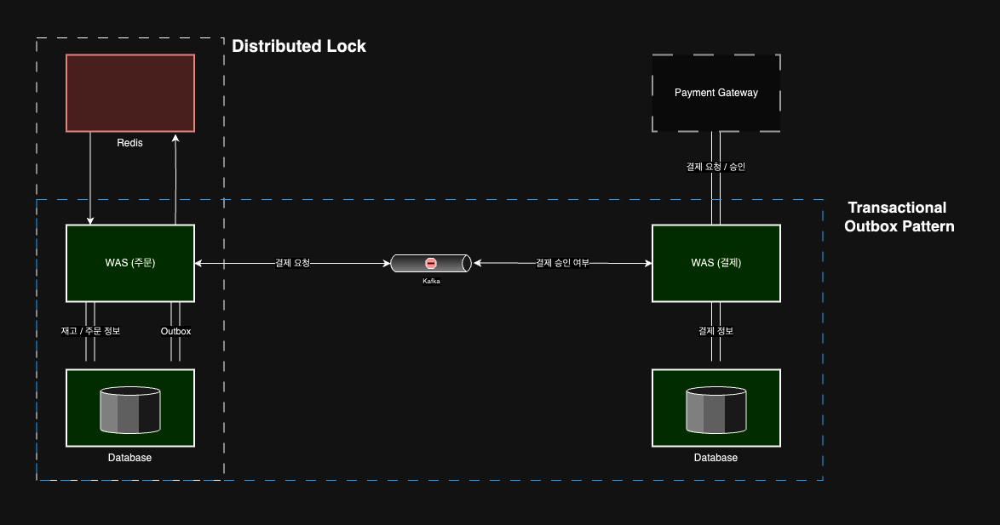

# Spring MSA Patterns
- Spring 을 사용하여 여러가지 MSA Pattern 들을 구현

## 배달 시스템

- <a href="https://github.com/taesukang-dev/spring-msa-patterns/tree/master/delivery">코드</a>
- 알아볼 수 있는 것
  - CQRS, CDC 활용 (Log Tailing Pattern, debezium)
  - Transactional Outbox Pattern (Polling Publisher Pattern)
  - Saga Choreography

## 재고관리 시스템

- <a href="https://liltdevs.tistory.com/215">블로그 글</a>
- <a href="https://github.com/taesukang-dev/spring-msa-patterns/tree/master/stock">코드</a>
- 알아볼 수 있는 것
  - Locking 기법 (Distributed Lock, Optimistic Lock, CAS)
  - Redis Data 백업 방식 (Disk)
  - Transactional Outbox Pattern (Polling Publisher Pattern)

## 선착순 쿠폰 시스템

- <a href="https://liltdevs.tistory.com/214">블로그 글</a>
- <a href="https://github.com/taesukang-dev/spring-msa-patterns/tree/master/coupon">코드</a>
- 알아볼 수 있는 것
  - Redisson Lock Acquire 구조(성능 위주)
  - Redis SortedSet, Set Computation Time
  - Kafka Messaging
