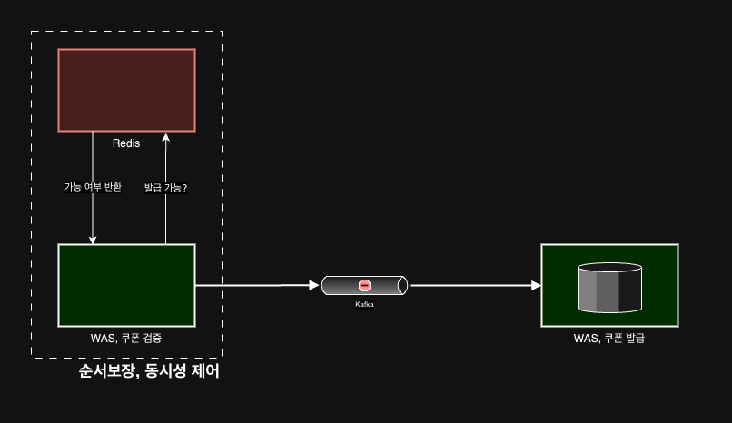

# 선착순 쿠폰 발급 시스템

 

선착순 쿠폰 발급시스템의 요건은 다음과 같습니다.
1. 정해진 수량 만큼만 쿠폰을 발급해야 합니다.
2. 들어온 순서대로 쿠폰을 발급해야 합니다. (First Come, First Served)
3. 단기간에 급증하는 트래픽을 견뎌야 합니다.

 

주어진 요건에 따라 기술적 해결책을 생각해보았습니다.
1. 정해진 수량
   1. 동시성을 제어한다.
   2. 즉, 두개의 요청이 하나의 변수에 대해 변경을 요구하여도 일관성을 가져야한다.
   3. Atomic 한 처리가 필요하다.
2. 들어온 순서대로 쿠폰을 발급
   1. Http Request 에 대한 개별 Thread(Tomcat) 의 요청이 순서대로 수행되게 제어해야 한다.
3. 단기간에 급증하는 트래픽
   1. 위와 같이 동시성을 제어하며, 순서를 보장하면서도 급증하는 트래픽을 견뎌야 한다.
   2. 단순히 Scale-Up 하는 방향보다 Scale-Out 할 수 있는 시스템이 유리.
      1. Thread Pool, Connection Pool 등의 개수를 100만개 1000만개 만들어 둘 수 없으니까...

 키워드는 `동시성 제어`, `순서 보장`, `Scale-Out` 이 될 것 같습니다.  
아래에서 더 자세히 알아보겠습니다.

## 동시성 제어
동시성 제어는 원자적 연산 보장으로 바꿔 말할 수 있을 것 같습니다.  
공유 데이터의 변화를 Thread Safe 하게 혹은 Thread 간 공유 데이터에 대해 경쟁할 수 없는 상태를 만드는 것입니다.  
이를 위해 주로 사용되는 동시성 제어 방법으로는 아래와 같은 것들이 있습니다.
1. Java Application
   1. Synchronized Block
   2. Reentrant Lock
   3. CAS
2. DB
   1. Pessimistic Lock
   2. Optimistic Lock
3. Redis
   1. Distributed Lock (Redisson)

각각의 방법에는 장단점이 있지만 현재 저희 요구에는 Scale Out 하는 것을 전제로 하였으니 여러 서버를 두는 시스템이므로 Java Application 에서 제공하는 Locking 방법들은 사용하지 못할 것 같습니다.
또한 DB Level 에서 지원하는 Locking 기법도 하나의 DB 에서 큰 트래픽을 받아내야 하고, Locking 하며 데드락의 위험이 있으니 SPOF 의 위험으로 사용이 어렵습니다.
그렇다면 Redisson 이 남아있는데요. Redisson 은 적합할지도 모르겠습니다. Single Thread 로 동작하며 하나의 요청에 한 번의 수행을 보장하며 여러 WAS 에서 접근할 수 있기 떄문입니다.
다만, 성능의 측면에서 Redisson 은 전혀 유리하지 않습니다. (실제로 제가 테스트했을 때 DB 의 비관적락과 비슷한 수준이었습니다.) Redisson 은 Spin Lock 의 형태를 지니지 않는, 다시 말해 Pub/Sub 기반의 NIO 로 빠른 성능을 지원할 것 같지만 꼭 그렇지만은 않습니다.
