# 배달 주문 시스템


배달 주문 시스템의 요건은 다음과 같습니다.
1. 주문 과 결제는 상태 불일치가 일어나서는 안됩니다.
   1. {주문 실패, 결제 성공} 과 같은 상태 불일치 pair 가 발생해서는 안됩니다.
2. 단기간에 급증하는 트래픽을 견뎌야 합니다. (점심 시간, 저녁 시간)
   1. 2021년 전국 음식점업 수는 572,550 이고 음식접 1 업체 당 메뉴를 10건으로 산정하면 -> 5,725,500 건입니다.
   2. 2022년 국토교통부 보도자료에 따르면 배달원 수는 23만명, 하루 평균 배달 건수는 약 40건 입니다.
   3. 따라서 하루 평균 920만건의 배달이 이뤄지고 있습니다.
3. 위와 같은 트래픽을 견디면서도 다양한 메뉴를 주문할 수 있어야 합니다.
   1. 음식점에서 메뉴를 추가하거나 상태를 변경할 수 있어야 합니다.

주어진 요건에 따라 기술적 요건을 생각해보았습니다.  

1. 주문과 결제는 무조건 성공하거나 실패
   1. 주문과 결제가 하나의 Transaction 이 되어야 함
   2. 주문 OK ⇒ 결제 OK, 주문 FAIL ⇒ 결제 FAIL 을 무조건 지켜야 한다.
   3. 분산 트랜잭션, Saga Pattern(+ Transactional Outbox Pattern)
2. 단기간에 급증하는 트래픽을 견뎌야 한다.
   1. Transaction 에 대한 보장과 함께 Scale-Out 할 수 있는, 확장성 있는 시스템을 구축
3. 다양한 메뉴 주문 및 상태 변경
   1. 메뉴를 주문하기 위해 조회하면서, 상태 변경에 대한 기능을 충족해야 함
   2. 920만건 + @ 에 대한 트래픽을 견뎌야 함
   3. 이를 위해 CQRS 패턴을 적용하면서 다른 물리적 위치에 있는 Data Sync를 맞춰야 함

키워드는 `Scale-Out`, `Saga Pattern`, `CQRS` 가 될 것 같습니다.

## 단기간에 급증하는 트래픽, Scale Out
배달 주문은 다음의 순서로 할 수 있습니다.
1. 주문을 요청한다. (Client)
2. 음식점에 메뉴를 확인하고 가능한지 판단한다. (Server)
3. 결제를 요청한다. (Server)
4. 음식점에서 주문을 승인한다. (Server)

Live System 에서는 주문을 승인하며 배달을 보낼 수도 있고, 이력 데이터를 쌓을 수도 있지만 이 프로젝트에서는 위 4단계에 대해서만 고려하겠습니다.  
잠시 언급했듯 일 평균 주문 건수는 920만건(23만 * 40) 입니다.  
(건방지게도 모든 market share 를 가진다고 가정합니다.)  

IO Event 기준으로 주문과 결제만 생각해본다면

1. 주문 시작 (HTTP Request 및 Database 적재) : 920 만 * 2 (실패 케이스 고려)
2. 결제 (결제 요청 및 Database 적재) : 920만 * 2
3. 주문 승인, 음식점 (Database 적재) : 920만 * 2N (주문과 세부 메뉴)

추산할 수 있는 IO Event는 4600만 건입니다.  
각각을 균등분배하여 IO Event 를 병렬 처리 하며 성능을 올리는 것이 합리적인 판단이라고 들게하는 큰 숫자입니다.  
Scale Out 을 위한 분배는 주문 요청 및 가능 판단(Order-Service), 결제 요청 (Payment-Service), 주문 승인 및 음식점(Restaurant-Service)으로 3개의 WAS 로 구성하겠습니다.  
서비스간 통신은 Kafka Messaging 을 통해 느슨한 결합과 비동기 통신으로의 병렬 처리를 유도하겠습니다.  

1. 주문을 요청한다. (Client)
2. 음식점에 메뉴를 확인하고 가능한지 판단 후 주문 시작. (Order-Service, 920 만 * 2)
3. 결제를 요청한다. (Payment-Service, 920만 * 2)
4. 음식점에서 주문을 승인한다. (Restaurant-Service, 920만 * 2N (주문과 세부 메뉴))

아주 간단한 work flow 이지만 적절한 Bounded Context 라는 판단이 들고 또 일어나야 하는 IO Event 도 잘 분배된 것 같습니다.    
위와 같이 역할을 나누어 비동기/병렬 처리를 유도해보도록 하겠습니다.  

단 이때 Order-Service 는 자신의 Domain 에 벗어나는 기능이 있습니다.  
주문 요청에 대한 Server 로써의 역할 뿐만 아니라 주문 요청에 대한 메뉴 가능 판단까지 겸해야할 필요가 있습니다.  
물론 주문 가능 판단을 음식점 서비스에 요청하여 결과값을 받아 올 수 있지만, 단지 이를 위한 통신이 비효율적이라는 판단입니다.  
아래 CQRS 에서 더 자세히 알아보도록 하겠습니다.  

## 주문과 결제는 무조건 성공하거나 실패, Saga Pattern
Saga Pattern 은 분산환경에서 Transaction 을 관리하기 위한 효과적인 방법입니다.  
주문과 결제로 Service 가 나눠진 현재 상황에 Data 원자성을 지키기 위한 방편입니다.  


Saga Pattern 을 알아보기 이전에 Spring XA Protocol 이 사용하는 2-Phase-Commit 을 먼저 알아보도록 하겠습니다.    
2PC 또한 여러 Node 간 다중 Transaction 에서 원자성을 지킬 수 있게 하는 방법입니다.    
2PC 는 데이터를 쓴 후 다중 Transaction 을 보장하기 위해 아래의 2단계를 거칩니다.  
1. prepare
   1. Coordinator 가 각 Node 들에 prepare 상태에 확인 요청을 합니다.
   2. 각 Node는 현재 prepare 상태에 대한 Y/N 응답을 합니다. 
2. commit
   1. 만일 위 prepare 응답 중 N 이 하나라도 있다면 Rollback 합니다.
   2. 모두 Y 라면 commit 합니다.

이처럼 모든 Node들이 준비된 상태에서만 Commit 하기 때문에 데이터에 대한 원자성을 보장할 수 있습니다.  
2PC는 단순한만큼 아래와 같은 단점들이 잇습니다.
- prepare/commit 은 동기적인 방식으로 진행되기 때문에 Transaction 시간만큼 Locking 되어있고, 이는 성능 저하의 문제로 이어질 수 있습니다.  
- 모든 책임은 Coordinator 에 있고, 이는 SPOF 의 위험으로 이어질 수 있습니다.
- NoSQL, Message Broker 등 은 2PC 를 지원하지 않습니다.

이런 제약들로 2PC 는 사용하기 쉽지 않아보입니다.  


Saga Pattern 은 각 서비스들의 원자성을 위해 CAP 정리에 따라 Consistency 를 조금 포기한 Eventual Consistency 지원합니다.  
위에서 살펴보았듯 2PC 는 Strong Consistency 를 지원하지만 가용성과 성능에 문제가 있을 수도 있기 때문입니다.  
서비스들은 각자의 Database 를 사용하면서 Local Transaction 으로 ACID 를 만족하고 만약 어떤 서비스에 문제가 생겼을 경우 Event 에 대한 취소 혹은 rollback 의 의미로 보상 트랜잭션을 발행합니다.

Saga pattern 은 다시 아래 2가지로 나눠집니다.
1. Choreography
   1. Local Transaction 이 적용되면 해당하는 Event 를 발행하여 다른 서비스의 Transaction 을 Trigger 합니다.
   2. 각각의 서비스들은 필요한 서비스들을 호출하며 느슨한 결합을 유지합니다.
   3. 역할이 분산되어 있기 때문에 SPOF 가 존재하지 않습니다.
   4. 다만 추적하기 어렵고 work flow 을 파악하기 어렵습니다.
   5. Circular Dependency 가 발생할 수 있습니다.
2. Orchestration
   1. 중앙 집중 방식으로 조정하는 서비스가 존재하고 각 서비스에게 Local Transaction 을 Trigger 합니다. 
   2. 중앙 집중 방식이므로 Orchestrator 는 활동에 대한 제어가 가능하고 복잡한 일을 한 곳에서 처리할 수 있습니다.
   3. 다만, Orchestrator 는 SPOF 의 위험이 될 수 있습니다.

중앙 제어를 할 만큼 복잡하거나 흐름을 제어할 필요가 없기 때문에 이번 프로젝트에서는 Choreography 를 구현하기로 하였습니다.

Saga Pattern 은 여러 Service 간 동시에 Transaction 을 실행하며 ACID 중 'I'solation 에 대한 문제가 있을 수도 있습니다.  
혹은 Kafka 가 Network 장애로 Messaging 이 되지 않을 수도 있습니다.   
이를 위해서 Transactional Outbox Pattern 과 Optimistic Locking 을 구현하여 방지할 수 있습니다.     

예시로 `주문 생성, 결제 요청` 단계를 코드로 설명하겠습니다.  

```java
// SagaHelper.java
@Transactional
 // 1. 주문 생성, 결제 요청 : user -> order-service request
 public void startOrder(OrderCommand orderCommand) {
     // ...
     // 주문 생성 및 데이터 초기화...
     // ...

     // payment event 발행을 위한 outbox 저장
     OrderPaymentOutboxMessage paymentOutboxMessage = orderPaymentOutboxMessageRepository.save(
             OrderPaymentOutboxMessage
                     .builder()
                     .orderId(order.getId())
                     .id(UUID.randomUUID())
                     .sagaId(UUID.randomUUID())
                     .outboxStatus(OutboxStatus.STARTED)
                     .totalPrice(totalPrice)
                     .userId(userId)
                     .build()
     );
     // ApplicationEventPublisher.sendMessageHandle(TransactionalEventListener) 로 event 발행
     publisher.publishEvent(
             mapper.outboxMessageToOrderPaymentEvent(
                     paymentOutboxMessage,
                     helper.applyCallback( // 콜백을 함께 넘겨 messaging 완료에 대한 상태를 저장한다.
                             paymentOutboxMessage,
                             orderPaymentOutboxMessageRepository::save
                     )
             )
     );
 }

 // OrderServiceExternalMessageListenerImpl.java
@Async
// Event 발행은 Transaction 이 완료되는 것을 보장해야 한다.
@TransactionalEventListener(phase = TransactionPhase.AFTER_COMMIT)
public void sendMessageHandle(OrderPaymentEvent orderPaymentEvent) {
     orderPaymentMessagePublisher.publish(orderPaymentEvent); // -> OrderPaymentMessageKafkaPublisher.publish 
}

// OrderPaymentMessageKafkaPublisher.java
public void publish(OrderPaymentEvent orderPaymentEvent) {
     log.info("Payment Request Message Published {}", orderPaymentEvent.getSagaId());

     CompletableFuture<SendResult<String, OrderPaymentAvroModel>> result = kafkaTemplate.send(
        PAYMENT_TOPIC,
        mapper.eventToAvroModel(orderPaymentEvent)
     );
     // Messaging 완료시에는 applyCallback 에서 넘겨준 BiConsumer 를 실행한다.
     // MessageCallbackHelper.BiConsumer
     result.whenComplete(orderPaymentEvent.getCallback());
}

// MessageCallbackHelper.java
public BiConsumer<SendResult<String, ?>, Throwable> applyCallback(
     OrderPaymentOutboxMessage message,
     Consumer<OrderPaymentOutboxMessage> save
) {
     return (result, ex) -> {
        if (ex == null) { // exception 이 없었다면 outbox status 를 completed 로 저장한다.
            save.accept(message.updateStatus(OutboxStatus.COMPLETED));
        } else { // exception 이 있었다면 outbox status 를 failed 로 변경한다.
            save.accept(message.updateStatus(OutboxStatus.FAILED));
        }
     };  
}
```

위 코드는 주문 생성을 위해 Event 를 발행하는 부분입니다.  
ApplicationEventPublisher 는 KafkaMessaging 을 하기 위해 일련의 절차가 모두 완료됨을 보장합니다.  
따라서 Event Publish 는 Transaction 을 보장한 후 실행됩니다.  

발행 이후 Kafka Messaging 이 완료되면 Callback 을 실행하며 Outbox 상태를 고쳐주어 해당 Messaging 이 정상적으로 수행됐는지에 대한 여부를 저장합니다.  
Network 장애로 인한 Messaging 유실이 있을 때에는 아래의 Scheduler 를 사용하여 Messaging 을 추가로 보장합니다.  

```java
// OrderPaymentOutboxScheduler.java
    @Transactional
    @Scheduled(fixedDelay = 3000L, initialDelay = 3000L)
    public void processOutboxMessage() {
        Optional<List<OrderPaymentOutboxMessage>> startedList = repository.findByStatus(OutboxStatus.STARTED);
        if (startedList.isPresent()) {
            List<OrderPaymentOutboxMessage> messages = startedList.get();
            messages.forEach(message -> publisher.publish(getPaymentEvent(message)));
        }
    }

    private OrderPaymentEvent getPaymentEvent(OrderPaymentOutboxMessage message) {
        return mapper.outboxMessageToOrderPaymentEvent(
                message,
                helper.applyCallback(
                        message,
                        repository::save
                )
        );
    }
```

Transactional Outbox Pattern 과 TransactionalEventListener 에 관한 내용은 아래 블로그 글에서 더욱 자세히 확인하실 수 있습니다.  

## 다양한 메뉴 주문 및 상태 변경, CQRS(CDC, Debezium)
언급했듯 주문 서비스(Order-Service) 는 음식점(Restaurant-Service) 의 데이터가 필요한 경우가 있습니다.  
주문 요청 당시 메뉴를 주문할 수 있는지에 대한 판별을 해야될 필요가 있는데요.   
API 조합 패턴으로 음식점 서비스에서 Rest API 로 필요한 정보를 가져오거나 메뉴에 대한 판별을 음식점 서비스에 위임할 수도 있습니다.  
다만 이 방법은 다음과 같은 단점으로 사용하기 어렵습니다.  
- 오버헤드의 증가 (API 호출 후 음식점 DB Read 필요)
- 가용성 저하 우려 (Rest API 를 사용하며 Blocking)
- 데이터 일관성 결여 (호출 당시와 호출 후의 데이터가 다를 수 있음)

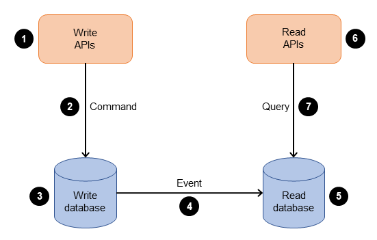

CQRS, Command Query Responsibility Segregation 는 명령과 조회 책임을 분리하는 패턴입니다.   
한 쪽에서는 CUD / 한 쪽에서는 R 을 수행하면서 부하를 분산하게 합니다.  


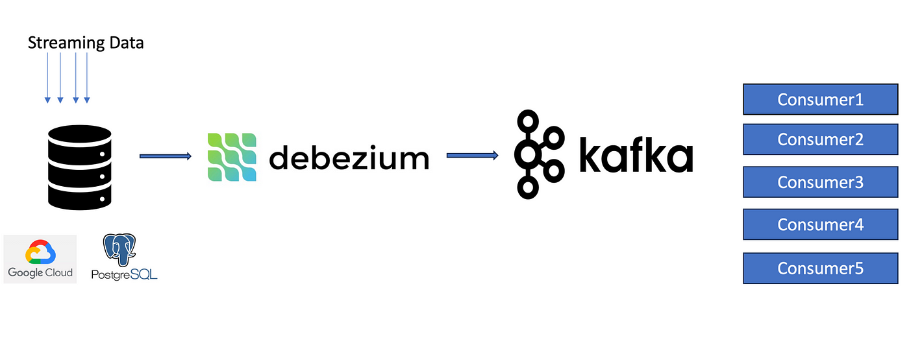

주문 서비스는 음식점 서비스의 데이터가 필요합니다. 하지만 위에서 살펴보았듯 API 조합 패턴은 효율적이지 않아 보입니다.  
그렇다고 음식점 서비스에서 발생하는 모든 이벤트를 하나하나 Messaging 하고, 이를 위해 Outbox, 코드 등을 추가하기엔 부담스럽습니다.  
Replication 은 관심사를 벗어나는 Database, Table 을 참조하게 되고 이 또한 좋은 방법으로 보이진 않습니다.  

CDC 는 CQRS 패턴을 구현하는 한 방법으로 CUD 를 수행하는 Node 에서는 실행한 쿼리를(bin log) 이벤트로 발행하고   
R 을 수행하는 Node 에서 이를 구독하여 최신 상태를 유지하게 합니다.  
또한 Data 를 구독하는 쪽의 제품을 RDB 가 아닌 읽기에 효율적인 제품(NoSQL, Search Engine...)을 사용하여도 상관 없습니다.  
API 조합 패턴으로 쿼리하여 거대한 Data 뭉치를 만드는 것 처럼 각각의 서비스들이 발행하는 Event 를 하나의 Data 뭉치로 만들어 저렴한 비용으로 효과적인 읽기를 수행하게할 수도 있습니다.  

Debezium 은 kafka Connector 를 사용하여 Source Database 의 Bin log 를 읽어 이를 Event 로 발행할 수 있도록 도와줍니다.  

저희는 이미 Messaging 을 위해 Kafka 를 사용하고 있고 Debezium 이라는 검증된 도구가 있으므로 사용해보도록 하겠습니다.  
Debezium 은 Data 의 변경을 기준으로 Event Streaming 하여 Subscriber 가 변경분을 적용할 수 있도록 도와줍니다.  

주문 서비스에서 음식점의 데이터가 필요하므로 음식점이 Source Data 가 됩니다.  
```bash
# ./docker/init-cdc.sh
# source
curl --location --request POST 'http://localhost:8083/connectors' \
--header 'Content-Type: application/json' \
--data-raw '{
  "name": "delivery-connector",
  "config": {
    # ...
    "database.hostname": "mysql-restaurant",
    "database.server.name": "mysql-restaurant",
    "database.allowPublicKeyRetrieval": "true",
    "database.include.list": "delivery",
    "database.history.kafka.bootstrap.servers": "kafka:29092",
    "database.history.kafka.topic": "dbhistory.delivery",
    # ...
  }
}'

# ./docker/init-cdc.sh
# sink
curl --location --request POST 'http://localhost:8083/connectors' \
--header 'Content-Type: application/json' \
--data-raw '{
  "name": "delivery-sink",
  "config": {
    # ...
    "connector.class": "io.confluent.connect.jdbc.JdbcSinkConnector",
    "connection.url": "jdbc:mysql://mysql:3306/delivery?user=root&password=1234",
    "delete.enabled": "true",
    "topics.regex": "mysql-restaurant.delivery.(.*)"
    # ...
  }
}'
```
위 명령어들로 Source Database 와 Sink(Consumer) Database 간 연결로 데이터 동기화를 합니다.  
Source Database 에서는 delivery 하위 Table 변경 Event(Upsert) 를 `mysql-restaurant.delivery.{TABLE_NAME}` topic 에 발행하고  
Sink Database 는 이를 소비하게 됩니다.  

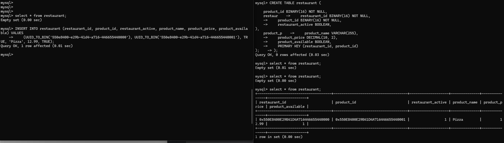

왼쪽이 Source 오른쪽이 Sink Database 입니다.   
Source 에서 Data 를 insert 하자 Sink Database 에서 잠시 후 동기화하는 모습을 확인하실 수 있습니다.   

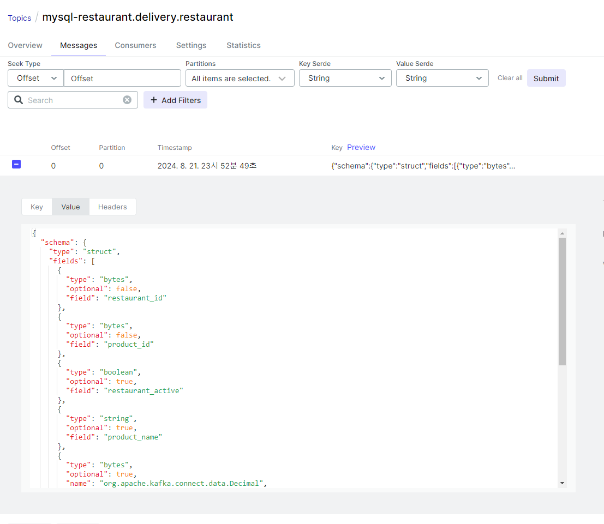

Topic 으로도 잘 발행된 것을 확인할 수 있습니다.  
이제 주문 서비스에서는 음식점 서비스의 데이터에 대해 직접적인 통신 요청 없이도 확인할 수 있게 되었습니다.  

다만 Domain 사용자는 이런 데이터가 어떻게 생성되었는지 알지 못합니다.  
Record를 조작해도 되는지에 대한 여부를 알지 못해 CUD 작업을 주문 서비스에서 하게 될 수 있습니다.  
이를 방지하기 위해 주문서비스에서 다루는 음식점 데이터를 View 로 사용합니다.

```java
// RestaurantEntity.class
@Table(name = "restaurant_view", schema = "restaurant")
@Entity
public class RestaurantEntity {
    @Id
    private UUID restaurantId;
    @Id
    private UUID productId;
    private Boolean restaurantActive;
    private String productName;
    private BigDecimal productPrice;
    private Boolean productAvailable;
}
```

```sql
drop table if exists restaurant;
CREATE TABLE restaurant (
    restaurant_id BINARY(16) NOT NULL,
    product_id BINARY(16) NOT NULL,
    restaurant_active BOOLEAN,
    product_name VARCHAR(255),
    product_price DECIMAL(10, 2),
    product_available BOOLEAN,
    PRIMARY KEY (restaurant_id, product_id)
);

drop view if exists restaurant_view;
CREATE VIEW restaurant_view AS
SELECT
    restaurant_id,
    product_id,
    restaurant_active,
    product_name,
    product_price,
    product_available
FROM
    restaurant;
```

데이터의 적재는 Restaurant Table 에 하면서도 단순히 Query 덩어리인 View 로 Entity Mapping 하여 데이터에 대한 조작을 할 수 없게 방지합니다.  


## 테스트

주문이 수행되는 Flow 는 아래와 같습니다. 

1. 주문을 요청한다. (Client)
2. 주문을 확인하고 결제를 요청한다. (Order -> Payment)
3. 결제를 승인하고 응답한다. (Payment -> Order)
4. 결제 승인을 확인하고 주문 승인을 요청한다. (Order -> Restaurant)
5. 주문 승인 요청을 확인하고 응답한다. (Restaurant -> Order)

이 순서대로 따라가보도록 하겠습니다.

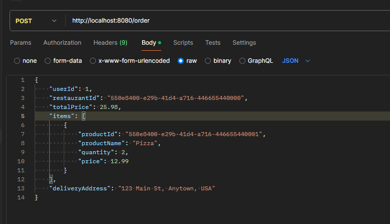

사용자는 HTTP 로 주문 서비스에 요청합니다.  

```java
// Order.class 
 public void validateOrder() {
        // 이제 시작하는 order 이므로 상태는 존재해서는 안 됩
     if (orderStatus != null || id != null) { 
         throw new RuntimeException("Already Initialized");
     }

     // 주문 금액이 없거나 0 이하여서는 안 됩
     if (totalPrice == null || !(totalPrice.compareTo(BigDecimal.ZERO) > 0)) {
         throw new RuntimeException("Not Available to buy");
     }

     // 요청으로 들어온 order item 의 총 합이 실제 restaurant 에서 확인한 금액과 달라서는 안 됩
     BigDecimal itemsTotal = orderItems.stream().map(item -> {
         if (!item.isPriceValid()) throw new RuntimeException("Not Available to buy");
         return item.getSubTotal();
     }).reduce(BigDecimal.ZERO, BigDecimal::add);
     if (!totalPrice.equals(itemsTotal)) {
         throw new RuntimeException("Total and SubTotal are not equal");
     }
 }
 
// Restaurant.class
public boolean isAvailable() {
    // restaurant 가 운영중이지 않거나 개별 메뉴가 가용하지 않으면 안 됨
     return isAvailable && products.stream().filter(e -> !e.isAvailable()).toList().isEmpty();
}
```

요청으로 들어온 Order 와 Restaurant 를 Domain 에서 확인 한 후 Message 로 발행합니다. 

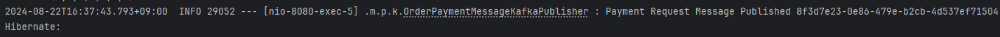

- 발행 이후의 로그

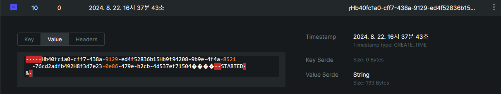

- 발행 이후의 Topic

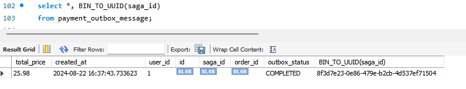

- 발행 이후의 outbox message

이후 Payment Service 에서 요청과 응답을 확인합니다.

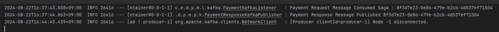

Payment Service 에서 요청과 응답의 Saga ID(UUID) 가 동일함을 확인합니다.  
다시 Order Service 를 확인합니다.  

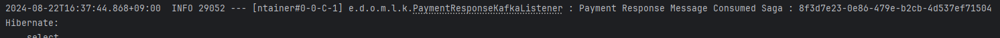
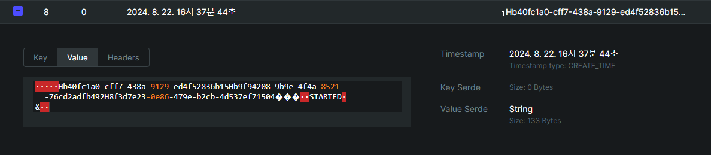

Order Service 에서 응답이 온 것을 확인하고 Restaurant Service 에 요청합니다.  

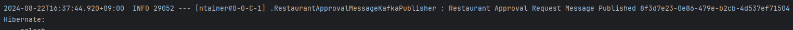
- 발행 이후의 로그

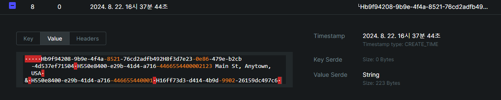
- 발행 이후의 Topic

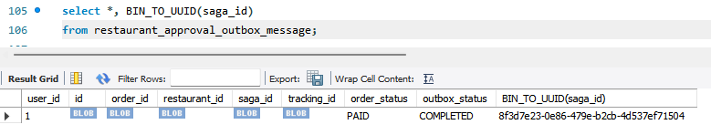
- 발행 이후의 Outbox Message

이후 Restaurant Service 에서 요청과 응답을 확인합니다.

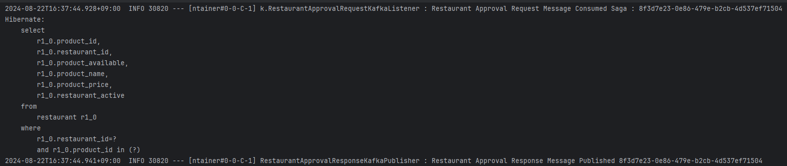

Restaurant Service 에서 요청과 응답의 Saga ID(UUID) 가 동일함을 확인합니다.  
다시 Order Service 를 확인합니다.  

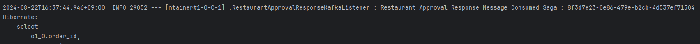
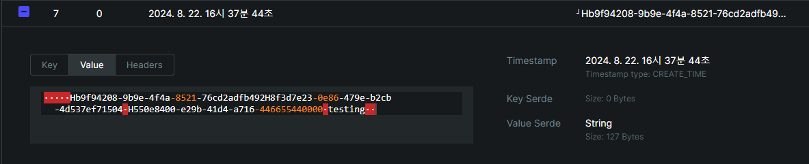

Order Service 가 Consume 한 것을 확인하고 Database 에서 Order 의 상태를 확인합니다.

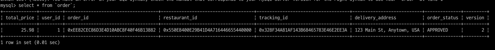

Order Status 가 APPROVED 로 주문 처리가 완료된 것을 확인합니다.

## 정리

배달 시스템의 요건에 대한 저의 답변은 다음과 같습니다.

1. 주문과 결제는 무조건 성공하거나 실패. ⇒ Transactional Outbox Pattern
2. 단기간에 급증하는 트래픽을 견뎌야 한다. ⇒ Saga Pattern Using Message Broker (Kafka)
3. 다양한 메뉴 주문 및 상태 변경 (트래픽을 견디며). ⇒ CQRS, CDC (Debezium)

끝!
