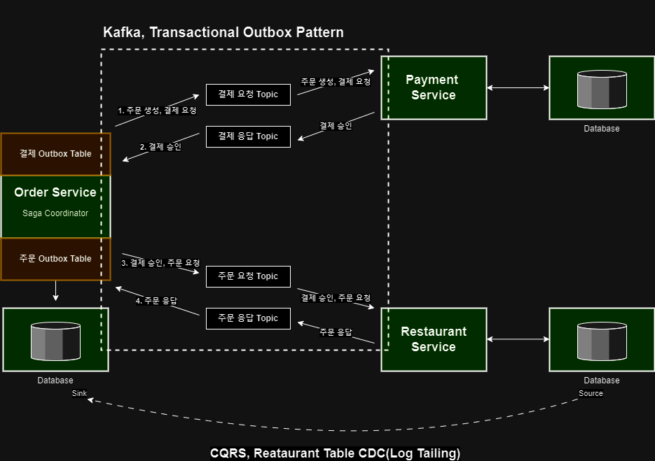
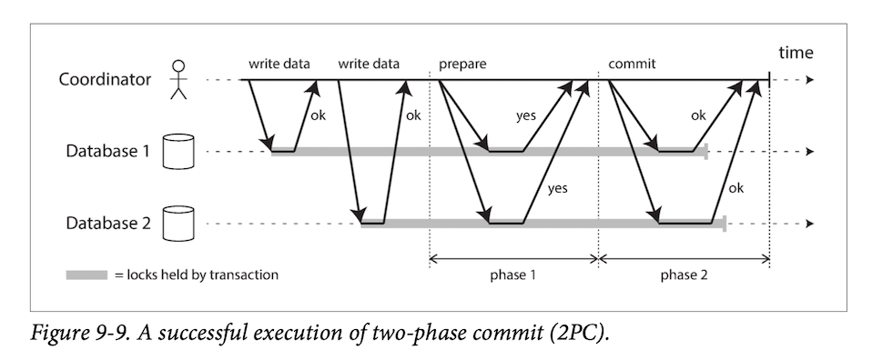
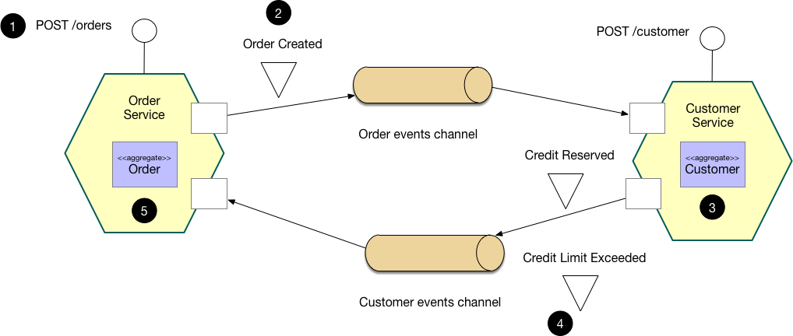

# 배달 주문 시스템

배달 주문 시스템의 요건은 다음과 같습니다.
1. 주문 과 결제는 상태 불일치가 일어나서는 안됩니다.
   1. {주문 실패, 결제 성공} 과 같은 상태 불일치 pair 가 발생해서는 안됩니다.
2. 단기간에 급증하는 트래픽을 견뎌야 합니다. (점심 시간, 저녁 시간)
   1. 2021년 전국 음식점업 수는 572,550 이고 음식접 1 업체 당 메뉴를 10건으로 산정하면 -> 5,725,500 건입니다.
   2. 2022년 국토교통부 보도자료에 따르면 배달원 수는 23만명, 하루 평균 배달 건수는 약 40건 입니다.
   3. 따라서 하루 평균 920만건의 배달이 이뤄지고 있습니다.
3. 위와 같은 트래픽을 견디면서도 다양한 메뉴를 주문할 수 있어야 합니다.
   1. 음식점에서 메뉴를 추가하거나 상태를 변경할 수 있어야 합니다.

주어진 요건에 따라 기술적 요건을 생각해보았습니다.  

1. 주문과 결제는 무조건 성공하거나 실패
   1. 주문과 결제가 하나의 Transaction 이 되어야 함
   2. 주문 OK ⇒ 결제 OK, 주문 FAIL ⇒ 결제 FAIL 을 무조건 지켜야 한다.
   3. 분산 트랜잭션, Saga Pattern
2. 단기간에 급증하는 트래픽을 견뎌야 한다.
   1. Transaction 에 대한 보장과 함께 Scale-Out 할 수 있는, 확장성 있는 시스템을 구축
3. 다양한 메뉴 주문 및 상태 변경
   1. 메뉴를 주문하기 위해 조회하면서, 상태 변경에 대한 기능을 충족해야 함
   2. 920만건 + @ 에 대한 트래픽을 견뎌야 함
   3. 이를 위해 CQRS 패턴을 적용하면서 다른 물리적 위치에 있는 Data Sync를 맞춰야 함

키워드는 `Scale-Out`, `Saga Pattern`, `CQRS` 가 될 것 같습니다.

## 단기간에 급증하는 트래픽, Scale Out
배달 주문은 다음의 순서로 할 수 있습니다.
1. 주문을 요청한다. (Client)
2. 음식점에 메뉴를 확인하고 가능한지 판단한다. (Server)
3. 결제를 요청한다. (Server)
4. 음식점에서 주문을 승인한다. (Server)

실제로는 주문을 승인하며 배달을 보낼 수도 있고, 이력 데이터를 쌓을 수도 있지만 이 프로젝트에서는 위 4단계에 대해서만 고려하겠습니다.  
위에서 잠시 언급했듯 일 평균 주문 건수는 920만건(23만 * 40) 입니다.  
IO 기준으로 주문과 결제만 생각해본다면

1. 주문 시작 (HTTP Request 및 Database 적재) : 920 만 * 2 (실패 케이스 고려)
2. 결제 (결제 요청 및 Database 적재) : 920만 * 2
3. 주문 승인, 음식점 (Database 적재) : 920만 * 2N (주문과 세부 메뉴)

추산할 수 있는 IO Event는 4600만 건입니다.  
각각을 균등분배하여 IO Event 를 병렬 처리 하며 성능을 올리는 것이 합리적인 판단이라고 들게하는 숫자입니다.  
Scale Out 을 위한 분배는 주문 요청 및 가능 판단(Order-Service), 결제 요청 (Payment-Service), 주문 승인 및 음식점(Restaurant-Service)으로 3개의 WAS 로 구성하겠습니다.  
서비스간 통신은 Kafka Messaging 을 통해 느슨한 결합과 병렬 처리를 유도하겠습니다.  

1. 주문을 요청한다. (Client)
2. 음식점에 메뉴를 확인하고 가능한지 판단 후 주문 시작. (Order-Service, 920 만 * 2)
3. 결제를 요청한다. (Payment-Service, 920만 * 2)
4. 음식점에서 주문을 승인한다. (Restaurant-Service, 920만 * 2N (주문과 세부 메뉴))

위와 같이 역할을 나누어 비동기/병렬 처리를 유도해보도록 하겠습니다.  

단 이때 Order-Service 는 자신의 Domain 에 벗어나는 기능이 있습니다.  
주문 요청에 대한 Server 로써의 역할 뿐만 아니라 주문 요청에 대한 메뉴 가능 판단까지 겸해야할 필요가 있습니다.  
물론 주문 가능 판단을 음식점 서비스에 요청하여 결과값을 받아 올 수 있지만, 단지 이를 위한 통신이 비효율적이라는 판단입니다.  
아래 CQRS 에서 더 자세히 알아보도록 하겠습니다.  

## 주문과 결제는 무조건 성공하거나 실패, Saga Pattern
Saga Pattern 은 분산환경에서 Transaction 을 관리하기 위한 효과적인 방법입니다.  
주문과 결제로 Service 가 나눠진 현재 상황에 Data 원자성을 지키기 위한 방편입니다.  

Saga Pattern 을 알아보기 이전에 Spring XA Protocol 이 사용하는 2-Phase-Commit 을 먼저 알아보도록 하겠습니다.    
2PC 또한 여러 Node 간 다중 Transaction 에서 원자성을 지킬 수 있게 하는 기술입니다.    
2PC 는 아래의 2단계를 거칩니다.  
1. prepare
   1. Coordinator 가 각 Node 들에 prepare 상태에 확인 요청을 합니다.
   2. 각 Node는 현재 prepare 상태에 대한 Y/N 응답을 합니다. 
2. commit
   1. 만일 위 prepare 응답 중 N 이 하나라도 있다면 Rollback 합니다.
   2. 모두 Y 라면 commit 합니다.

이처럼 모든 Node들이 준비된 상태에서만 Commit 하기 때문에 데이터에 대한 원자성을 보장할 수 있습니다.  
2PC는 단순한만큼 아래와 같은 단점들이 잇습니다.
- prepare/commit 은 동기적인 방식으로 진행되기 때문에 Transaction 시간만큼 Locking 되어있고, 이는 성능 저하의 문제로 이어질 수 있습니다.  
- 모든 책임은 Coordinator 에 있고, 이는 SPOF 의 위험으로 이어질 수 있습니다.
- NoSQL 은 2PC 를 지원하지 않습니다.

이런 제약들로 2PC 는 사용하기 쉽지 않아보입니다.  

Saga Pattern 은 각 서비스들의 원자성을 위해 CAP 정리에 따라 Consistency 를 조금 포기한 Eventual Consistency 지원합니다.  
위에서 살펴보았듯 2PC 는 Strong Consistency 를 지원하지만 가용성과 성능에 문제가 있을 수도 있기 때문입니다.  
각 서비스들은 스스로의 Database 를 사용하면서 Local Transaction 으로 ACID 를 만족하고 만약 어떤 서비스에서 문제가 생겼을 경우 보상 트랜잭션을 발행함으로써 롤백합니다.  
보상 트랜잭션은 Event 에 대한 취소 혹은 rollback 의 의미로 발행됩니다.  

이런 Saga pattern 은 2가지로 나눠집니다.
1. Choreography
   1. Local Transaction 이 적용되면 해당하는 Event 를 발행하여 다른 서비스의 Transaction 을 Trigger 합니다.
   2. 각각의 서비스들은 필요한 서비스들을 호출하며 느슨한 결합을 유지합니다.
   3. 역할이 분산되어 있기 때문에 SPOF 가 존재하지 않습니다.
   4. 다만 추적하기 어렵고 work flow 을 파악하기 어렵습니다.
   5. Circular Dependency 가 발생할 수 있습니다.
2. Orchestration
   1. 중앙 집중 방식으로 조정하는 서비스가 존재하고 각 서비스에게 Local Transaction 을 Trigger 합니다. 
   2. 중앙 집중 방식이므로 Orchestrator 는 활동에 대한 제어가 가능하고 복잡한 일을 한 곳에서 처리할 수 있습니다.
   3. 다만, Orchestrator 는 SPOF 의 위험이 될 수 있습니다.
   4. 또한 한 곳에서 처리하므로 너무 많은 정보로 비대해지고 이는 느슨한 결합을 추구하는 MSA에서는 적합해 보이지 않습니다.

중앙 제어를 할 만큼 복잡하거나 흐름을 제어할 필요가 없다는 이유로 이번 프로젝트에서는 Choreography 를 구현하기로 하였습니다.

Saga Pattern 은 ACID 중 Isolation 에 대한 문제가 있을 수도 있습니다.  
여러 Service 간 동시에 Transaction 을 실행하며 이상 현상을 야기할 수도 있습니다.  
혹은 Kafka 가 SPOF 로 Messaging 이 되지 않을 수도 있습니다.  
Local Transaction 에서 처리 이후 Event 를 발행하였으나 모종의 문제로 Messaging 이 되지 않을 수 있습니다.  
이를 위해서 Transactional Outbox Pattern 과 Optimistic Locking 을 구현하여 방지할 수 있습니다.   
아래에서 서비스를 실행하며 알아보겠습니다.  

Transactional Outbox Pattern 과 TransactionalEventListener 에 관한 내용은 아래 블로그 글에서 확인하실 수 있습니다.  

## 다양한 메뉴 주문 및 상태 변경, CQRS
CQRS, Command Query Responsibility Segregation 의 약자로 명령과 조회 책임을 분리하는 패턴입니다.  
- Command 는 상태를 변경하고 결과값을 반환하지 않는다.
- Query 는 상태를 변경하지 않고 결과값을 반환한다.

를 기본원칙으로 합니다.

