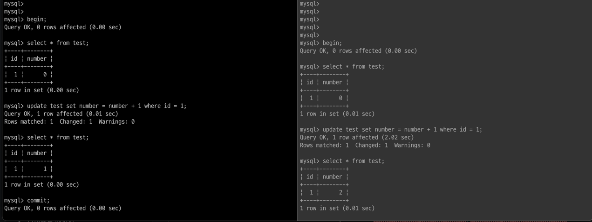
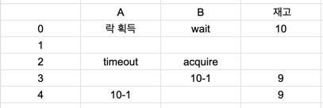
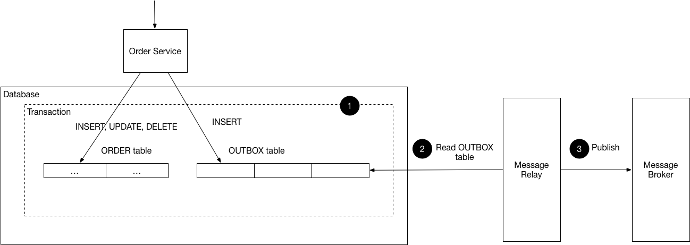
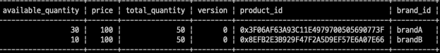
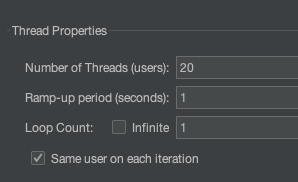
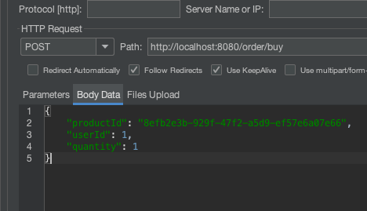
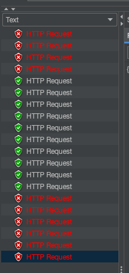
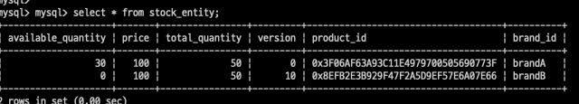
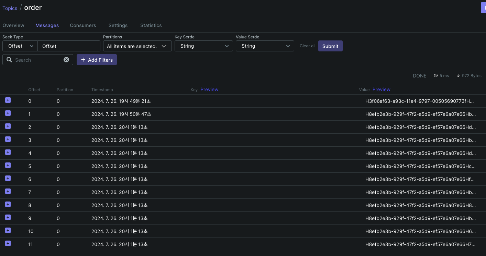

# 재고 관리 시스템


재고 관리 시스템의 요건은 다음과 같습니다.
1. 정해진 재고 만큼만 주문이 이뤄져야 합니다. 
   1. 이때 주문은 아주 민감하게 이뤄져야 합니다. Hello World 에서 일어난 일이 Real World 에 영향을 미쳐서는 안 됩니다.
   2. 주문 처리가 제대로 되지 않는다면 이를 위한 CS 비용, 재무적 책임 등 cost 가 높습니다.
2. 주문과 결제는 무조건 성공하거나 무조건 실패해야 합니다.
   1. 어떤 경우에도 {주문 실패, 결제 성공}과 같은 상태 불일치 pair 는 발생해서는 안됩니다.
3. 주문과 결제는 시간이 너무 오래 걸려서는 안됩니다.
   1. 사용자 경험을 저해할수록 사용자는 이탈하게 될 가능성이 높습니다.
   2. 주문과 결제가 아주 많은 트래픽이 있을 가능성은 낮지만 그럼에도 불구하고 원활한 환경을 제공해야 합니다.

주어진 요건에 따라 기술적 요건을 생각해보았습니다.

1. 정해진 재고 만큼만 주문
   1. 동시성을 제어한다.
   2. 재고에 대한 Atomic 한 처리가 필요하다.
   3. 다만 재고는 Durability 가 굉장히 중요하다. ⇒ 요건 1-1
   4. 이전 Coupon System 에서 했던 Redis Set 을 이용하는 방식은 한계점이 존재한다.
   5. 재고에 Locking 하면서도 갱신 손실을 대비하기 위한 CAS 연산이 필요하다.
2. 주문과 결제는 무조건 성공하거나 무조건 실패.
   1. 주문과 결제가 하나의 Transaction 이 되어야 함.
   2. 주문 OK ⇒ 결제 OK, 주문 FAIL ⇒ 결제 FAIL 을 무조건 지켜야 한다.
3. 주문과 결제는 시간이 너무 오래 걸려서는 안됨.
   1. 위와 같은 요건들을 만족하면서도 원활한 사용자 경험을 제공해야 함.
   2. 이때 결제는 HTTP Request 가 필요하다.
      1. 결제사, PG...
   3. 외부와 통신하면서도 성능과 Transaction 을 유지해야함. ⇒ Transactional Outbox Pattern

키워드는 `동시성 제어(내구성에 유의)`, `Transaction`, `Scale-Out (Transactional Outbox Pattern)` 이 될 것 같습니다.

## 정해진 재고 만큼만 주문 (동시성 제어, 내구성에 유의)

이전 쿠폰 시스템에서는 여러가지 동시성 기법을 알아보며 결과적으로 Redis Set 을 활용하는 방법을 선택하였습니다.  
사용자 요청을 서버에서 받으면 쿠폰 발행량을 체크하여 Redis Set 사이즈와 비교한 뒤 Set 의 사이즈가 쿠폰 발행량을 넘지 않았다면 Set 에 사용자를 추가하여 발행하는 방식이었는데요.  
성능보다 데이터 내구성이 중요해진 만큼 위와 같은 방식은 사용하지 못할 것 같습니다.

Redis 는 데이터를 저장하며 AOF/RDB 라는 방식으로 백업합니다.  
RDB 는 메모리에 있는 전체 데이터를 특정 주기로 백업하는 방식으로 수행됩니다.   
이때 무작정 전부를 백업하는 것이 아닌, Copy On Write 방식을 취합니다.  
Copy On Write 는 Parent Process 의 메모리를 모두 가져와 비교한 뒤 자신의 것으로 만드는 것이기 때문에 백업하는 순간 Redis 의 메모리 사용량은 2배 이상이 되고, 이는 SWAP 의 위험이 있습니다.  

AOF 는 Buffer 에 데이터를 쓰고 데이터 변경 이후 Disk에 쓰는 방식입니다.  
따라서 만약 Buffer 에는 데이터가 쓰여졌지만 Redis 가 장애로 Down 됐고 Failback 했을 때 해당 데이터는 Logging 되지 않았기 때문에 복구할 수 없습니다.  
이 또한 특정 주기로 이뤄지지만 매 Command 마다 Logging 할 수 있는 옵션도 있습니다.  
다만 매 Command 마다 Logging 하게 된다면 매 Command 는 Disk IO 로 Redis 가 갖고 있는 빠른 성능에 대한 장점이 희석됩니다.  

따라서, redis 에서 계수를 사용하는 방식은 redis 가 장애 발생으로 내려간다면 데이터 유실 가능성이 있습니다.   
이를 위해 redis 의 cluster / sentinel 을 사용할 수 있지만 (우선 데이터를 slave 에 보낸 뒤에 aof 에 쓰기 때문에)   
redis 는 async 방식으로 replication 하며 최초 sync 이후 모든 write 명령을 slave 에 전송하는데   
이때 slave 는 데이터를 받았는지 전송 결과를 ack 하지 않기 때문에 데이터 gap 은 분명 존재할 수 있습니다.  

이런 경우 MySQL 에서는 innodb_flush_log_at_trx_commit, rpl_semi_sync_master_wait_point 옵션을 사용하여 제어할 수 있습니다.    
innodb_flush_log_at_trx_commit=0 옵션을 사용하여 모든 변경사항을 Disk 에 저장한 뒤에 사용자에게 응답하게 되고, (물론 성능적 저하는 있습니다.)  
rpl_semi_sync_master_wait_point=after_sync 옵션을 사용한다면 우선 replica 에게 데이터를 보내고 commit 하게 되므로 장애 발생하여 failover 하게 되면 해당 데이터를 갖고 있는 node 가 master 가 되며 eventually consistency 를 만족하게 됩니다.  
(MHA 기준의 예시입니다.)

따라서 Redis 에서 제어하는 것보다 MySQL 혹은 Database 를 사용하는 제어 방식이 데이터 내구성 측면에서는 유리해보입니다.   
이때 무조건 Distributed Lock 을 사용하기보다 왜 Database 의 X Lock 은 안되는가에 대해 생각해보고자 합니다.  
MySQL Repeatable Read 수준에서 X Lock 은 원자적 연산을 보장하기 때문에 단순히 동시성을 제어하기 위해서 Redisson이 필요할까에 대한 고찰입니다.  

이를테면 아래와 같은 상황입니다.  



1. 왼쪽, 오른쪽 세션에서 트랜잭션을 함께 시작했습니다.
2. 왼쪽과 오른쪽 세션은 number 가 0 임을 확인합니다.
3. 왼쪽 세션에서 update 하고 select 했을 때 1임을 확인하고 commit 합니다.
4. 오른쪽 세션에서 update 하고 select 했을 때 2임을 확인합니다.
   1. 이때 왼쪽 세션에서 다시 select 한다고 해도 오른쪽 세션은 commit 하지 않았기 때문에 아직 number 는 1 입니다.
5. 오른쪽 세션에서 commit 하고 왼쪽 오른쪽 세션은 모두 number 가 2임을 확인합니다.

저러한 특성에 기인한다면 원자성을 보장하므로 Distributed Lock 을 사용하지 않아도 될 것 처럼 보입니다.  
하지만 여전히 Redisson 은 유용합니다.  
X Lock 은 비용이 높고 배타적 특성을 갖고 있기 때문에 Deadlock 의 발생 확률이 높기 때문입니다.  
그에 반해 Redisson 은 Redis 의 원자적 특성과 NIO 기반으로 동작하는 Pub/Sub 기반의 Locking 기법으로 Database 의 책임을 분할합니다.  

따라서 MySQL 의 X-Lock 을 사용했을 때 위의 장애 상황으로 인해 DB 가 down 된다면 서비스 자체가 불가능해지지만(DB 의존성이 높습니다.),  
Redisson 을 사용한다면 DB 의 접근은 가능하기 때문에 주문과 관련된 서비스는 장애가 발생할 수 있지만 다른 서비스는 지속적인 서비스가 가능합니다.  

하지만, Redisson 을 사용하며 여전히 예측할 수 있는 장애상황이 있습니다.  
Redisson 을 사용하며 하나의 트랜잭션이 무한정 Lock 을 획득할 수 없게 Lock Timeout 을 설정하게 되는데요.  
이때 갱신 손실이 발생하게 될 수 있습니다.



1. A가 락을 획득하고 B 는 대기합니다.
2. A가 모종의 이유로 Lock 이 Timeout 으로 획득을 해제하고 이때 B 가 획득합니다.
3. B 는 현재 재고를 기준으로 -1 연산합니다.
4. A 의 네트워크가 다시 정상화 되어 당시 재고를 기준으로 -1 연산합니다.

Thread 경합과 관련된 예제와 비슷한 상황입니다.  
따라서 같은 상태에 대한 Versioning 을 통해 이러한 상황을 방지해야 합니다.  
이는 Optimistic Locking 을 CAS 연산으로 활용하는 것으로 할 수 있습니다.  

```java
// StockServiceHelper.java
@DistributedLock
private void checkQuantityAndUpdate(StockBuyCommand stockBuyCommand) {
    Stock stock = stockRepository.findById(stockBuyCommand.productId())
            .orElseThrow(() -> new RuntimeException("Item Not Found"));
    if (!stock.isAvailableToBuy(stockBuyCommand.quantity())) {
        throw new RuntimeException("Not available to buy");
    }

    int updateQuantity = stock.getAvailableQuantity() - stockBuyCommand.quantity();
    stock.updateAvailableQuantity(updateQuantity);

    try {
        stockRepository.save(stock);
    } catch (OptimisticLockingFailureException e) {
        throw new RuntimeException("Lost Update Occurred");
    }
}
```

위와 같이 stock(재고) 에 대해 Distributed Locking 을 하면서도 stock 을 update 하는 순간에 혹시 모를 갱신 손실을 대비하는 것입니다.  
정리하면, RDB 를 사용하여 내구성을 지원하면서도 Locking 책임을 분산하기 위해 Redisson 을 사용하며 혹시 모를 갱신 손실을 대비하여 Optimistic Locking 을 하는 것입니다.  

추가로 궁금하신 사항은 아래를 확인해주세요!
- <a href="https://liltdevs.tistory.com/192">MySQL Locking</a>
- <a href="https://liltdevs.tistory.com/198">redisson</a>

## 주문과 결제 성능 및 Transaction 보장 (Transactional Outbox Pattern)
주문과 결제의 순서를 생각해본다면 아래와 같습니다.
1. 사용자가 제품을 주문한다. (client)
2. 재고 처리를 한다. (server)
   1. DB 에서 상품을 가져와 주문량 만큼을 뺀다.
3. 결제 처리를 한다. (server)
   1. PG 혹은 결제사에 결제를 요청한다. ⇒ HTTP Request
4. 주문을 완료 처리 한다. (server)

위와 같은 순서로 처리된다면 Transaction 은 2, 3, 4 로 총 3개입니다.  
사용자는 3개의 Transaction 이 완료되면 주문 완료에 대한 응답을 받을 수 있게 됩니다.  
이러한 시스템은 Transaction 간 결합도가 높아지는 것은 물론 성능상 이점을 갖기도 어렵습니다.  
따라서 재고 처리를 하는 Server 와 결제 처리를 하는 Server 로 역할을 분리하여 서버별 병렬처리를 유도하고 Server 간 요청-응답을 Messaging 하여 느슨하게 결합하기로 하였습니다.   

다만, 이때 Kafka 가 SPOF 가 될 위험이 있습니다.  
만약 장애 상황으로 Kafka 가 Down 된다거나 네트워크 장애로 Messaging 이 되지 않는다면 재고 처리는 되었으나 결제는 되지 않는 손해가 발생할 수 있습니다.    
이를 위해 Transactional Outbox Pattern 을 구현하였습니다.



만약 Event 가 Kafka 를 통해 정상적으로 Messaging 되지 않았을 때를 대비하여 Messaging 상태를 Outbox Table 에 저장하는 방식을 따랐습니다.  
저장된 Outbox Table 을 주기적으로 확인하여 전송에 실패한 Event 를 다시 Publish 하며 Eventually Consistency 를 만족하여 언젠가는 데이터 정합성을 맞추게 됩니다.  

```java
// OrderOutboxMessage.java
public class OrderOutboxMessage {
   private UUID id;
   private UUID orderId;
   private Long userId;
   private UUID productId;
   private int quantity;
   private OrderStatus orderStatus;
   private OutboxStatus outboxStatus; // STARTED, COMPLETED, FAILED
}

// OrderOutboxScheduler.java
@EnableScheduling
@RequiredArgsConstructor
@Component
public class OrderOutboxScheduler {

   private final OrderOutboxRepository orderOutboxRepository;
   private final OrderRequestMessagePublisher orderRequestMessagePublisher;

   @Transactional
   @Scheduled
   public void processOutboxMessages() {
      // STARTED 상태인 outbox message 를 가져온다.
      orderOutboxRepository.findByStatus(OutboxStatus.STARTED);
      // publisher 로 다시 payment service 에 messaging 한다.
      orderRequestMessagePublisher.publish(...);
   }
}
```
재고 처리를 한 뒤에 결제 요청(OrderOutboxMessage)은 무조건 성공(COMPLETED)하거나 실패(FAILED)해야 합니다.  
따라서 Scheduling 하며 처리 되지 않은 요청(STARTED) 를 모두 가져와 다시금 Kafka Messaging 하게 됩니다.  

또한 무조건 재고 처리가 완료되어야 결제를 요청할 수 있습니다.  
재고 처리가 정상적으로 수행되지 않았음에도 불구하고 결제 요청이 날아간다면 사용자는 돈만 지불하고 물건은 못받게 되고... 시스템 요건 2번에 어긋나는 상태가 됩니다.  
이를 위해 @TransactionalEventListener 를 사용합니다.  

```java
// StockServiceHelper
@Transactional
public Order buy(StockBuyCommand stockBuyCommand) {
  // 재고 처리
  checkQuantityAndUpdate(stockBuyCommand);
  Order pendingOrder = orderRepository.save(
          createOrder(stockBuyCommand)
  );
  // Outbox 저장
  orderOutboxRepository.save(
          OrderOutboxMessage.builder()
                  .id(UUID.randomUUID())
                  .orderId(pendingOrder.getId())
                  .userId(stockBuyCommand.userId())
                  .productId(stockBuyCommand.productId())
                  .quantity(stockBuyCommand.quantity())
                  .orderStatus(pendingOrder.getOrderStatus())
                  .outboxStatus(OutboxStatus.STARTED)
                  .build()
  );
  // @TransactionalEventListener(phase = TransactionPhase.AFTER_COMMIT) 로 위 처리들이 정상적으로 수행됐다면 실행
  publisher.publishEvent( // => OrderExternalMessageListenerImpl.sendMessageHandle
          mapper.stockBuyCommandToEvent(stockBuyCommand, pendingOrder.getId())
  );
  return pendingOrder;
}

// OrderExternalMessageListenerImpl
@RequiredArgsConstructor
@Component
public class OrderExternalMessageListenerImpl implements OrderExternalMessageListener {

   private final OrderRequestMessagePublisher orderRequestMessagePublisher;

   @Override
   @Async
   @TransactionalEventListener(phase = TransactionPhase.AFTER_COMMIT)
   public void sendMessageHandle(StockBuyEvent stockBuyEvent) {
       // Kafka 결제 요청 Message 발행
      orderRequestMessagePublisher.publish(stockBuyEvent);
   }
}
```

TransactionalEventListener 는 AFTER_COMMIT 으로 모든 처리들이 정상적으로 처리된 상황, commit 된 상황에만 Kafka Messaging 을 하게 될 것입니다.  
따라서 주문 - 결제 요청은 모두 성공하거나, 모두 실패하는 등 일관성을 유지할 수 있게 됩니다. 

재고 - 결제 처리가 되는 순서는 다음과 같습니다.
1. 재고 처리 (Distributed Lock, Optimistic Lock)
2. 주문(Order) 를 생성
3. Outbox 저장
4. 위 처리들이 정상적으로 수행됐다면 결제 요청을 위한 Kafka Messaging
   1. 유실된 Message 가 있다면 Scheduler 가 재요청 처리

위 처리들이 완료되면 결제 서버에서는 재고 처리 서버로 결제 승인 여부를 Kafka Messaging 하게 되고 그에 맞춰 재고 처리 서버는 아래와 같이 수행합니다.

```java
// PaymentResponseKafkaListener
@RequiredArgsConstructor
@Component
public class PaymentResponseKafkaListener {

   private final PaymentResponseMessageListener paymentResponseMessageListener;
   private final OrderMessagingMapper mapper;

   @KafkaListener(topics = PAYMENT_TOPIC, groupId = "spring")
   public void consumer(@Payload PaymentResponseAvroModel paymentResponseAvroModel) {
      if (paymentResponseAvroModel.getResult()) {
         paymentResponseMessageListener.paymentComplete( // => OrderPaymentSaga.process
                 mapper.paymentResponseAvroModelToPayResponse(paymentResponseAvroModel)
         );
      } else {
         paymentResponseMessageListener.paymentCancelled( // => OrderPaymentSaga.rollback
                 mapper.paymentResponseAvroModelToPayResponse(paymentResponseAvroModel)
         );
      }
   }
}


// OrderPaymentSaga
@Transactional
public void process(PaymentResponse paymentResponse) {
  // order -> PAID
  Order order = orderRepository.findById(paymentResponse.getOrderId())
          .orElseThrow(() -> new RuntimeException("Order Not Found"));
  orderRepository.save(order.updateStatus(PAID));

  // outbox -> COMPLETED
  OrderOutboxMessage orderOutboxMessage = orderOutboxRepository.findByOrderId(paymentResponse.getOrderId())
          .orElseThrow(() -> new RuntimeException("Message Not Found"));
  orderOutboxMessage.updateStatus(OutboxStatus.COMPLETED);
  orderOutboxRepository.save(orderOutboxMessage);
}
```

위와 같이 재고 처리 서버는 결제가 완료됐다는 처리, Outbox를 Complete 하며 Saga 를 완료합니다.  
서버의 역할을 분리하여 사용자가 부담해야될 Transation 을 서버별 병렬처리하도록 유도하면서 Transactional Outbox Pattern 을 사용하여 데이터 정합성을 보장하도록 설계하였습니다.  
마지막으로 실제로 테스트를 수행하겠습니다.

## 테스트



brandB 에 있는 10개의 재고를 모두 소진시켜 보겠습니다.




20개의 user 가 동시에 1개씩 요청하겠습니다. 따라서 10개의 요청은 성공, 10개의 요청은 실패해야 합니다.



예상한 대로 10개의 요청이 잘 수행되었습니다.  
(왜 중간의 요청부터 10개가 성공했는지 궁금하신 분들은 쿠폰 시스템 게시글을 참고해주세요!)  



재고는 정상적으로 0, version 은 10으로 확인할 수 있습니다.  
또한 저희는 Kafka Messaging 을 TransactionalEventListener 로 제어했으니 10개의 요청만 날아갔는지 확인할 필요가 있습니다.  



20시 1분이 테스트를 위한 최초의 요청이므로 offset 2번부터 11까지 10개가 잘 요청된 것을 확인할 수 있습니다.  

## 정리
재고 관리 시스템의 요건에 대한 저의 답변은 다음과 같습니다.
1. 정해진 재고 만큼만 주문 (동시성 제어, 내구성에 유의) ⇒ Distributed Lock + Optimistic Lock
2. 주문과 결제는 무조건 성공하거나 무조건 실패 ⇒ @TransactionalEventListener(phase = TransactionPhase.AFTER_COMMIT) + Transactional Outbox Pattern
3. 주문과 결제 성능 ⇒ Transactional Outbox Pattern

끝!
